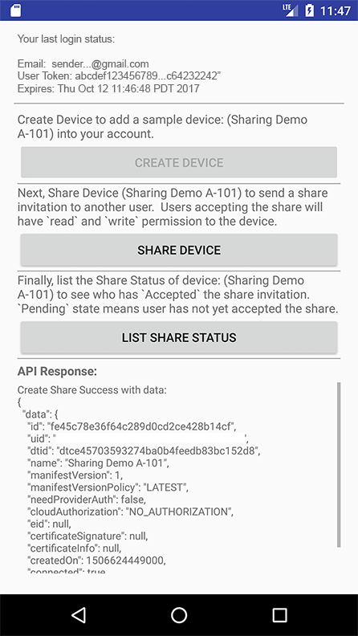

# Sample Android Device Sharing

Let's build an Android application that [shares user’s devices](https://developer.artik.cloud/documentation/device-sharing.html) to others.  The application uses ARTIK Cloud [device share REST APIs](https://developer.artik.cloud/documentation/api-reference/rest-api.html).

After completing this sample, you will learn:

* How to make a API call to [share a device](https://developer.artik.cloud/documentation/api-reference/rest-api.html#create-a-device-share).
* How to make a API call to see the device [share status](https://developer.artik.cloud/documentation/api-reference/rest-api.html#get-device-shares) and see who has accepted the share.
* How to make a API call to [delete a share](https://developer.artik.cloud/documentation/api-reference/rest-api.html#delete-a-device-share).
* How to accept a share invitation. 

## Prerequisites
* Android Studio
* Android SDK for API level 25

## Setup / Installation:

### Set up at ARTIK Cloud

Follow [these instructions](https://developer.artik.cloud/documentation/tools/web-tools.html#creating-an-application) to **create an application** using the Developer Dashboard.   For this tutorial, select the following:

1. Set "Redirect URL" for your application to `cloud.artik.example.oauth://oauth2callback`.
2. Under Authentication, **only check "Authorization Code with PKCE" as AUTH METHODS**. 

[Make a note of your client ID](https://developer.artik.cloud/documentation/tools/web-tools.html#how-to-find-your-application-id), which you will need in the next step.

3. Set the User Profile access to **Read and Write** permissions.   Sharing a device requires both these permissions.
4. Set the [Device Type Permission to the Application](https://developer.artik.cloud/dashboard/applications).  For this sample **add** the device type: Demo Fire Sensor (unique name: cloud.artik.sample.demofiresensor) with **Read And Write** permissions

### Set up your Android project

- Change `CLIENT_ID` to your own client ID (application ID) at the following lines in `Config.java`:

~~~java
private static final String CLIENT_ID = "YOUR_CLIENT_ID";
~~~

- Make sure `REDIRECT_URI` at the following line in `Config.java` is consistent with "Redirect URL" for your application at the Developer Dashboard:

~~~java
public static final String REDIRECT_URI = "cloud.artik.example.oauth://oauth2callback";
~~~

- Take note we have already filled in the Device Type ID for the Demo Fire Sensor in `Config.java`

~~~java
public static final String DEVICE_TYPE_ID = "dtce45703593274ba0b4feedb83bc152d8";
~~~

- Make sure the `intent-filter` field for `net.openid.appauth.RedirectUriReceiverActivity` in `AndroidManifest.xml` respects "Redirect URL" for your application at the Developer Dashboard.

~~~java
<data android:scheme="cloud.artik.example.oauth" android:host="oauth2callback"/>
~~~

- Make sure the `appAuthRedirectScheme` at the following line in `build.gradle` (Module: app) respects "Redirect URL" for your application at the Developer Dashboard:

~~~java
manifestPlaceholders = [appAuthRedirectScheme: "cloud.artik.example.oauth://oauth2callback"]
~~~

- Build the Android project

### Demo

1. Click login button to signin:

2. Enter your credentials to authenticate:

3. After successful login, the app obtains the user token.   This token is used to retrieve your profile information and make further API calls.

4. Click "Create Device" to add a sample device into your account:

5. Click Share Device to share the device with another user.   

5. Enter the email address to send a share invitation.   The user will receive an invitation via email to accept the share.

6. Click the List Share Status button to list the share status.   Here we see that the status is initially set to "PENDING".   This means a share request has been sent, however the user (receiver) has not yet accepted the share.    Let's do that in the next step.

7. Let's go ahead and accept the share invitation.   Receiver should check email box for a share invitation that looks like the following.  Accept the Invite.

8. Now go back to the sample application.   Click on the List Share Status button again.   Notice the status has updated to "ACCEPTED".   The receiver now has "read" and "write" access to the device.

9. Let's take a quick look at the User Portal.   Log into the Sharer  (Demo User) Account.  Take note in the Devices Dashboard there is now a "Sharing with Others" icon.  Similarly, login to the (Receiver) account.   The receiver has a "Shared with me" Icon.    

You can also share directly from the User portal by clicking on the "lightning bolt" icon.   Please note that that only the owner of the device will be able to share.  In this case the (receiver) cannot share the device because the receiver is not the owner.

10. To Revoke or Remove the share, go back to the Sample Application.    Click on the List Share Status button again.   Click on the share item to delete the share.

11. After running the sample, clean up by deleting any Demo Fire Sensor devices you added to your account. You can do this in the Devices menu at [https://my.artik.cloud](https://my.artik.cloud/)

More about ARTIK Cloud
---------------

- If you are not familiar with ARTIK Cloud, we have extensive documentation at https://developer.artik.cloud/documentation
- The full ARTIK Cloud API specification can be found at https://developer.artik.cloud/documentation/api-reference/
- Check out sample applications at https://developer.artik.cloud/documentation/tutorials/
- To create and manage your services and devices on ARTIK Cloud, visit the Developer Dashboard at https://developer.artik.cloud

License and Copyright
---------------------

Licensed under the Apache License. See [LICENSE](LICENSE).

Copyright (c) 2017 Samsung Electronics Co., Ltd.
